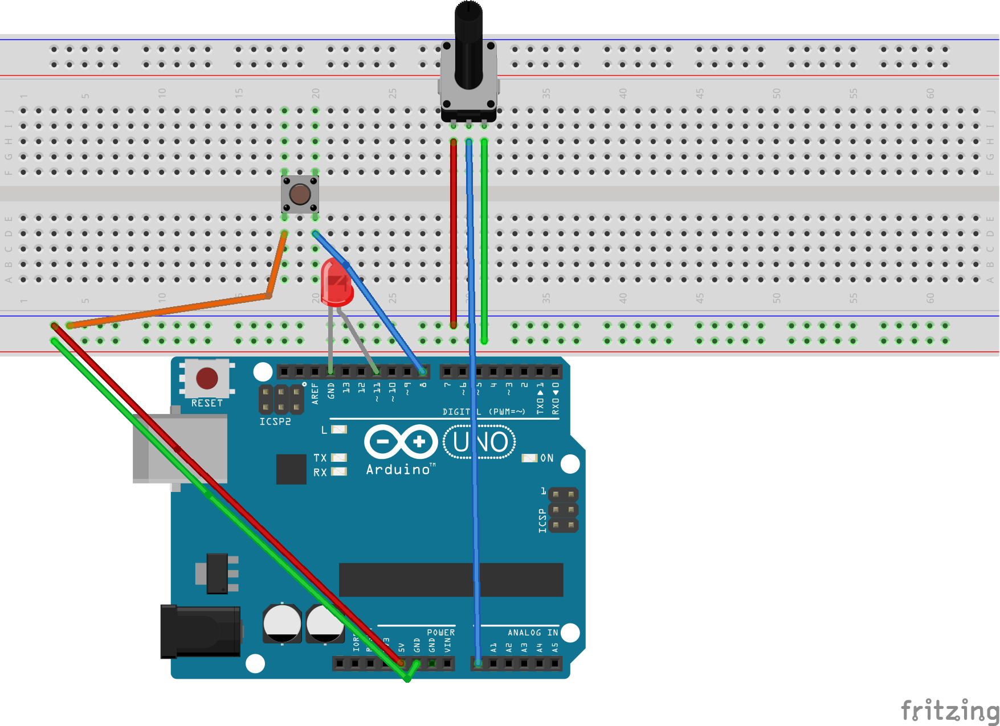

# Arduino-Cylon.js Examples

[Cylon.js](http://cylonjs.com/) is a JavaScript framework for robotics. These examples are JavaScript ports of the [original C examples](https://www.arduino.cc/en/Tutorial/BuiltInExamples) that come with an Arduino starter kit. The original examples are also included in this repo along side the JavaScript examples.

## Prerequisites

* [Arduino Starter Kit](https://www.arduino.cc/en/Main/ArduinoStarterKit)
* Install [cylon.js](http://cylonjs.com/documentation/getting-started/)
* Install [gort](http://gort.io/)

## Setup

* Run npm install
* Run gort to get your local arduino's serial port
* Determine your local path to Arduino software
* Update arduino.json, robot.conf and sketch.conf with your local settings
* Setup Arduino and breadboard to match the circuit used in the code

### Arduino and Breadboard Circuit

This single circuit works for all the examples so far, 1 and 5, for both Arduino and Cylon code. The circuit has an LED on the Arduino pins 13 and ground. Then power from 5V and ground to the breadboard power and ground. Finally, a push button on the breadboard is connected on pins 8 and power from the Arduino.

## Arduino Examples

The Arduino examples are in the sketch directory and can be run using sketch.sh. Make sure to update sketch.conf with your local settings.

### View help

./sketch.sh help

### Run sketch 1

./sketch.sh 1

### Run sketch 2

./sketch.sh 2

### Run robot 5

./sketch.sh 5

## Cylon Examples

The cylon.js examples are in the robot directory and can be run using robot.sh. Make sure to update robot.conf with your local settings.

### View help

./robot.sh help

### Setup firmata on arduino

./robot.sh setup

### Run robot 1

./robot.sh 1

### Run robot 2

./robot.sh 2

### Run robot 5

./robot.sh 5

## References

[SIK Experiment Guide for Arduino - V3.2](https://learn.sparkfun.com/tutorials/sik-experiment-guide-for-arduino---v32/all)

[Arduino Built-In Examples](https://www.arduino.cc/en/Tutorial/BuiltInExamples)

[Arduino manpage.doc](https://github.com/arduino/Arduino/blob/master/build/shared/manpage.adoc)
